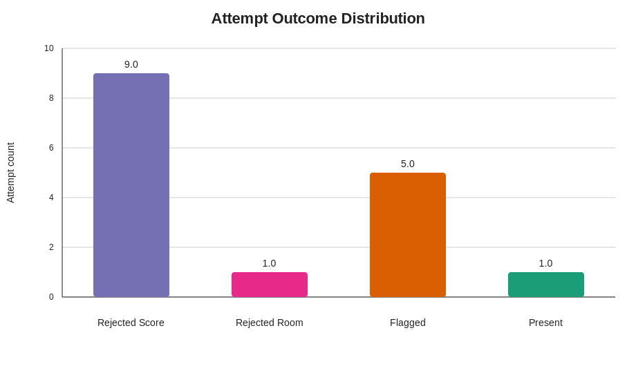
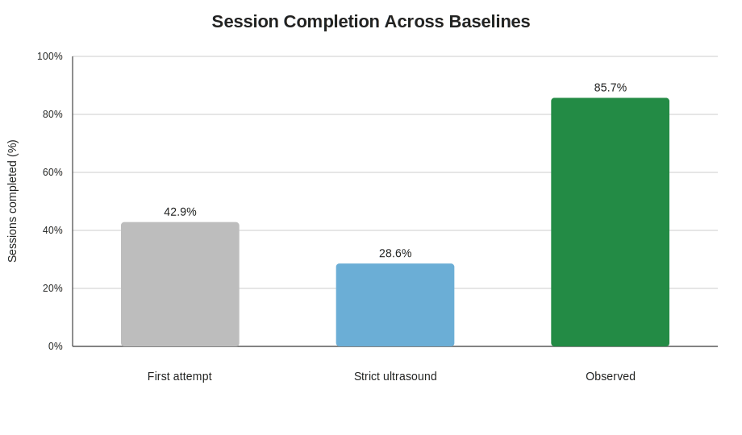
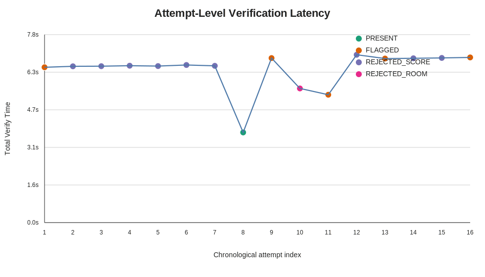
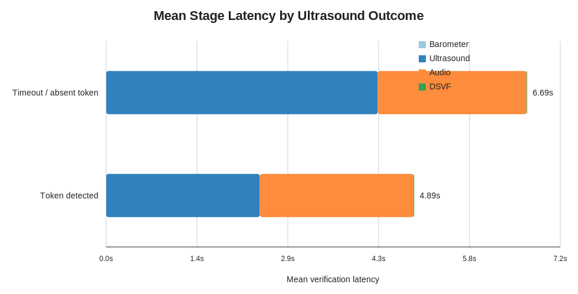

# DSVF: Dynamic Signal-Validity Fusion for Infrastructure-Free Smartphone Attendance Verification

Author metadata to be inserted before submission.

## Abstract
Proxy-resistant attendance remains difficult in multi-room academic environments because commodity wireless signals alone do not prove physical co-presence. This work extracts and validates a publishable systems contribution from Digital Sphere, an Android attendance verifier that combines Bluetooth Low Energy (BLE), barometric pressure, near-ultrasonic room tokens, and ambient audio fingerprints within a Dynamic Signal-Validity Fusion (DSVF) engine. The central contribution is not merely multimodality, but validity-aware multimodality: each sensor is first assessed for instantaneous reliability, unreliable modalities are down-weighted or suppressed, hard gates are reserved for high-confidence floor and room evidence, and failed attempts are opportunistically re-verified while the user remains in range. Using seven real attendance scans comprising sixteen end-to-end verification attempts collected from two commodity Android phones, the deployed pipeline completed 85.71% of scan sessions despite 100% barometer absence on the participating devices and 81.25% ultrasound timeout or non-detection events. Counterfactual replay on the same traces shows that a first-attempt-only policy would have completed 42.86% of sessions, while a strict mandatory-ultrasound policy would have completed only 28.57%. In successful sessions, 66.67% of completions depended on graceful degradation rather than successful ultrasonic decoding. Verification latency averaged 6.36 s end to end, while the DSVF computation itself contributed only 2.19 ms on average. When an ultrasonic token was decoded, mean verification latency dropped from 6.70 s to 4.90 s, with perfect effect separation (Cliff's delta = -1.0; exact Mann-Whitney p = 0.0036). These results position DSVF as a pragmatic contribution for heterogeneous smartphone deployments, where sensor availability and reliability fluctuate substantially at runtime.

**Keywords:** attendance verification, BLE, ultrasound, ambient audio, barometer, sensor fusion, co-presence, Android, proxy resistance

## I. Introduction
Large classrooms still rely on roll call, QR scans, or fixed biometric checkpoints, all of which exhibit known operational and security weaknesses. Roll call consumes teaching time. QR and app-based check-ins can be relayed. Biometric installations improve identity assurance but require dedicated hardware, networked back ends, and continuous maintenance. A smartphone-only alternative is attractive, but RSSI alone is a poor proof of co-presence because it is unstable across handsets, penetrates walls, and cannot distinguish between adjacent rooms or floors.

Digital Sphere addresses this problem with a phone-to-phone verification stack in which the professor's phone advertises a session over BLE and the student's phone verifies proximity using multiple independent physical signals. The engineering challenge is not only to combine signals, but to do so on heterogeneous devices where some sensors may be absent, blocked by OEM processing, or temporarily unreliable. The supplied field traces make that challenge explicit: both observed devices lacked barometers, and ultrasonic non-detection dominated the verification workload.

This paper therefore focuses on the strongest defensible research contribution exposed by the code and logs: **validity-aware multimodal attendance verification with graceful degradation and opportunistic re-verification**. Instead of failing closed whenever a modality is missing, the system estimates per-signal trust, redistributes fusion weight at runtime, and keeps re-verifying while the student remains in range. The resulting behavior is quantitatively stronger than naive one-shot or mandatory-all-sensors policies on the same real traces.

The main contributions are:

1. A six-stage DSVF decision engine that separates hard security gates, signal validity estimation, dynamic weighting, presence scoring, conflict detection, and final decision fusion.
2. A pre-fusion modality-validity gate in the student pipeline that suppresses unreliable ultrasonic evidence before it can cause spurious hard rejections on commodity smartphones.
3. A trace-grounded evaluation showing that validity-aware degradation materially improves session completion under sensor scarcity and ultrasonic instability, while adding negligible computational overhead.

## II. Related Work
BLE-based attendance systems already exist, but they typically depend on fixed classroom infrastructure. Puckdeevongs et al. proposed a BLE classroom attendance framework in which Bluetooth stations installed in the room collect student RSSI measurements and forward them to server-side positioning and attendance modules [1]. That architecture is useful for smart-campus deployment, but it assumes installed sensors, networked processing, and room instrumentation rather than ad hoc professor-to-student phone operation.

BLE itself is also known to be device-sensitive. Agarwal's DeepBLE study collected more than 50,000 BLE RSSI measurements from fifteen smartphone models and highlighted strong cross-device RSSI variability [2]. This motivates treating RSSI as informative but not authoritative, especially when attendance security depends on fine-grained co-presence rather than coarse indoor localization.

Ambient audio has been used as a proximity cue in authentication. Sound-Proof established that simultaneous ambient sound can validate the proximity of two devices without extra user interaction [3]. However, that work targets browser-to-phone authentication, not classroom attendance, and it does not jointly reason over BLE, barometric, and ultrasonic evidence.

Commodity smartphone ultrasound has likewise been explored for proximity networking. Novak et al. demonstrated ultrasound-based communication and proximity exchange using phone speakers and microphones, emphasizing the practicality of high-frequency signaling on mobile hardware [4]. Digital Sphere uses ultrasound differently: not as a data channel, but as a room-confinement token whose decoding result is fused with other modalities.

For vertical discrimination, Ye et al. showed that barometric sensing can support smartphone floor localization without preinstalled Wi-Fi anchors [5]. Their work addresses multi-floor localization as a standalone problem. In contrast, Digital Sphere uses differential barometric agreement as a hard security gate inside a broader co-presence verifier.

To the best of our knowledge, the reviewed literature does not report an **attendance verifier** that jointly combines smartphone-only BLE discovery, differential barometric floor locking, ultrasonic room tokens, ambient audio fingerprints, and runtime validity-aware fusion. The distinctive aspect is not just the sensor set, but the way Digital Sphere handles unreliable modalities without discarding the entire verification attempt.

## III. Proposed System

### A. End-to-End Data Flow
The professor starts a session, causing the device to:

1. Broadcast a BLE service UUID and manufacturer payload containing barometric pressure, a session token, and a quantized ambient-audio hash.
2. Optionally emit an 18.5 kHz on-off-keyed ultrasonic token derived from the session identifier.
3. Scan for student beacons to register marked attendance.

The student device scans for the professor beacon, records RSSI, unpacks the professor metadata, and triggers verification once RSSI crosses `-75 dBm`. The verification flow then executes barometer, ultrasound, and ambient-audio steps, constructs a `SignalReading`, and passes it to the `VerificationEngine`, which delegates scoring to the stateless `DsvfAlgorithm`.

### B. Six-Stage DSVF Pipeline
The core decision logic is implemented in [`app/src/main/java/com/example/digitalsphere/domain/verification/DsvfAlgorithm.java`](/Users/yash_2111825/AndroidStudioProjects/DigitalSphere/app/src/main/java/com/example/digitalsphere/domain/verification/DsvfAlgorithm.java).

**Stage 1: Hard gates.** Two mandatory checks can terminate verification before scoring:

- **Barometric floor lock:** reject if `|p_student - p_professor| >= 0.30 hPa`.
- **Ultrasound room lock:** reject if an ultrasonic reading is considered available and either the token mismatches or confidence is below `0.30`.

**Stage 2: Signal Validity Scores (SVS).** Each modality is assigned a trust score in `[0,1]`:

- `SVS_ble = 0.6 * norm(RSSI) + 0.4 * min(sample_count / 10, 1)`
- `SVS_baro = 1 - clamp(variance / 0.10)`
- `SVS_ultra = clamp(confidence)`
- `SVS_audio = 0.7 * |Pearson(hash_s, hash_p)| + 0.3 * clamp(SNR / 20)`

**Stage 3: Dynamic weights.** Base weights `(0.20, 0.25, 0.35, 0.20)` for BLE, barometer, ultrasound, and audio are multiplied by SVS and renormalized:

`w_i = (w_i^base * SVS_i) / Σ_j (w_j^base * SVS_j)`

This means unreliable sensors automatically contribute less to the final decision.

**Stage 4: Presence scores.** Each modality produces a presence-evidence score:

- `P_ble = norm(RSSI, -90, -50)`
- `P_baro = 1 - |Δp| / 0.30`
- `P_ultra = confidence`
- `P_audio = (Pearson + 1) / 2`

**Stage 5: Conflict detection.** If at least two high-trust modalities (`SVS > 0.70`) disagree by more than `0.40` in presence score, the attempt is labeled `CONFLICT`.

**Stage 6: Final fusion.** The fusion score is:

`F = Σ_i w_i * P_i`

with thresholds `F >= 0.75 -> PRESENT`, `0.55 <= F < 0.75 -> FLAGGED`, and `F < 0.55 -> REJECTED_SCORE`.

### C. Reliability-Aware Ingestion
The publishable systems insight appears one layer above DSVF in [`app/src/main/java/com/example/digitalsphere/presenter/StudentPresenter.java`](/Users/yash_2111825/AndroidStudioProjects/DigitalSphere/app/src/main/java/com/example/digitalsphere/presenter/StudentPresenter.java). Before ultrasound evidence is added to the `SignalReading`, the student pipeline checks:

`ultraReliable = detected && confidence >= 0.5 && expectedToken >= 0`

Only reliable ultrasonic evidence is included. Timeout events, empty detections, or low-confidence ghosts are therefore treated as **modality absence**, not as room-level hard failures. This distinction is crucial on heterogeneous phones: it converts missing or unstable ultrasound into degraded fusion rather than immediate rejection. The logs show that this behavior dominates observed success.

### D. Opportunistic Re-Verification
If a student remains in range but the current attempt does not mark attendance, scanning continues and the presenter can re-enter the verification flow. This yields a practical recovery mechanism when ultrasound or ambient audio fluctuates. The code records each attempt independently, which enabled the trace-grounded comparison reported in Section VI.

## IV. Methodology

### A. Artifact Set
The evaluation uses:

- the Android codebase,
- the system report for architectural context,
- two real JSON session reports generated by the app's diagnostic logger,
- reconstructed CSV and SVG artifacts produced by [`research_artifacts/extract_metrics.py`](/Users/yash_2111825/AndroidStudioProjects/DigitalSphere/research_artifacts/extract_metrics.py).

The logger records device capability events, scan milestones, stage-level durations, fusion outcomes, and attendance-marking events. Each JSON report is therefore a full event trace rather than a summary.

### B. Dataset Reconstruction
The supplied traces expand into:

- **2 devices**
- **7 scan sessions**
- **16 verification attempts**

All metrics in this paper are derived from those events; no synthetic measurements are introduced.

The extracted machine-readable artifacts are:

- [`attempt_metrics.csv`](/Users/yash_2111825/AndroidStudioProjects/DigitalSphere/research_artifacts/attempt_metrics.csv)
- [`session_metrics.csv`](/Users/yash_2111825/AndroidStudioProjects/DigitalSphere/research_artifacts/session_metrics.csv)
- [`device_capabilities.csv`](/Users/yash_2111825/AndroidStudioProjects/DigitalSphere/research_artifacts/device_capabilities.csv)
- [`metrics_summary.json`](/Users/yash_2111825/AndroidStudioProjects/DigitalSphere/research_artifacts/metrics_summary.json)

### C. Evaluation Metrics
We report:

- session completion rate,
- attempt acceptance rate,
- modality timeout rate,
- stage-wise latency,
- total verification latency,
- time to beacon discovery and in-range trigger,
- accepted-outcome distribution (`PRESENT` vs. `FLAGGED`),
- counterfactual session completion under alternative policies.

For latency separation between successful ultrasonic detection and timeout/no-detection attempts, we apply an **exact Mann-Whitney test** and report **Cliff's delta**.

### D. Counterfactual Baselines
Two baselines were derived from the same traces.

**Baseline 1: First-attempt-only.** Only the first verification attempt of each scan session is considered. This captures a naive one-shot UX without re-verification.

**Baseline 2: Strict mandatory ultrasound.** A session succeeds only if a marked attempt contains a matched ultrasonic token with confidence at least `0.30`. This emulates a design in which room verification cannot be bypassed by validity-aware degradation.

These baselines are conservative, trace-replayable, and directly tied to the code paths that distinguish the observed system from simpler policies.

## V. Experimental Setup
Both supplied devices were commodity Android phones with BLE advertising and scanning support, granted microphone permissions, and initialized audio-recording pipelines. Neither participating phone exposed a barometer, which turns the evaluation into a realistic degraded-hardware scenario rather than a best-case benchmark.

The system settings relevant to the measured pipeline were:

- BLE scan mode: low latency
- in-range trigger: `RSSI >= -75 dBm`
- ultrasound carrier: `18.5 kHz`
- audio fingerprint duration: `2 s`
- audio fingerprint size: `8` quantized bands carried in the BLE payload
- DSVF thresholds: `0.75` for `PRESENT`, `0.55` for `FLAGGED`

Expected ultrasonic session tokens were computed from the code's session-token derivation and matched the traces for both sessions (`1234 -> 2`, `cs101 -> 2`).

## VI. Results and Discussion

### A. Reliability Under Missing Modalities
The strongest empirical result is that the deployed pipeline remains operational under severe modality loss.

| Metric | Value |
|---|---:|
| Devices with barometer available | 0 / 2 |
| Ultrasound timeout or absent-token attempts | 13 / 16 (81.25%) |
| Sessions completed by observed system | 6 / 7 (85.71%) |
| Sessions completed by first-attempt-only baseline | 3 / 7 (42.86%) |
| Sessions completed by strict mandatory-ultrasound baseline | 2 / 7 (28.57%) |
| Successful sessions requiring fallback rather than matched ultrasound | 4 / 6 (66.67%) |

This is the paper's core result. A naive mandatory-ultrasound interpretation would have caused most scans to fail, because ultrasonic decoding was unstable or absent in most attempts. Instead, the deployed system recovered by reallocating trust to BLE and audio. Relative to the strict-ultrasound baseline, observed completion improves by **200%**. Relative to first-attempt-only operation, observed completion improves by **100%**.

The result is not simply “more sensors help.” In the observed traces, **fewer usable sensors** were often available. The contribution is that the system knows how to proceed safely anyway.

### B. Decision Behavior
The outcome distribution across all sixteen attempts was intentionally conservative:

| Outcome | Count |
|---|---:|
| `REJECTED_SCORE` | 9 |
| `REJECTED_ROOM` | 1 |
| `FLAGGED` | 5 |
| `PRESENT` | 1 |

All successful attendance markings came from `FLAGGED` or `PRESENT`, exactly as encoded in the implementation. The dominance of `FLAGGED` among accepted decisions indicates that the verifier prefers cautious acceptance with review semantics rather than aggressive auto-pass behavior. This is desirable for an attendance security system because it limits overconfident positive decisions under degraded sensing.

The single `REJECTED_ROOM` event is also important. It shows that room-level vetoes are preserved when the system receives a confident but mismatched ultrasonic token; the degradation policy does not blindly accept everything when ultrasound is present.

### C. Latency Decomposition
The mean end-to-end verification latency was **6.36 s**, with a median of **6.55 s**. However, the computational burden of fusion was negligible:

| Stage | Mean latency |
|---|---:|
| Barometer step | 1.31 ms |
| Ultrasound step | 3966.19 ms |
| Audio step | 2379.81 ms |
| DSVF evaluation | 2.19 ms |

On average, ultrasound consumed **62.33%** of verification time and ambient audio consumed **37.40%**, while DSVF itself contributed only **0.03%**. Therefore, optimization opportunities lie in sensing and capture orchestration, not in the fusion algorithm's runtime.

### D. Effect of Successful Ultrasonic Detection
When an ultrasonic token was successfully decoded, the pipeline became significantly faster:

- mean total verification latency dropped from **6.70 s** to **4.90 s**
- median latency dropped from **6.58 s** to **5.34 s**
- exact Mann-Whitney `U = 0`, `p = 0.0036`
- Cliff's delta = `-1.0`

This perfect effect separation means every detected-token attempt finished faster than every timeout/no-token attempt in the trace set. The reduction is dominated by shorter ultrasonic step duration: timeout attempts averaged **4.32 s** in the ultrasonic stage, versus **2.44 s** when a token was decoded.

The result suggests that ultrasound is a dual-purpose signal in this system: it strengthens room assurance when it works, and it acts as the main latency bottleneck when it does not.

### E. Discovery and User-Perceived Delay
Before verification begins, the system must first discover the professor beacon and wait until RSSI crosses the in-range threshold. Across scan sessions:

- mean time to first beacon: **1.14 s**
- median time to first beacon: **0.30 s**
- mean time to in-range trigger: **1.23 s**
- median time to in-range trigger: **0.32 s**

The median user-visible delay is therefore dominated by verification, not by BLE discovery. However, the worst session required seven verification attempts and **54.19 s** before marking, which suggests a practical improvement direction: adaptive retry pacing and earlier short-circuiting when repeated ultrasonic timeouts accumulate.

### F. Research Interpretation
The field traces support the following claim:

> In heterogeneous smartphone deployments, runtime validity management is more important than nominal sensor count.

Both observed devices had no barometer; most attempts had no usable ultrasound; yet the system still marked attendance in six of seven scan sessions. The paper's novelty is therefore not the existence of four modalities in isolation, but the **controlled degradation policy** that keeps the verifier usable under realistic device constraints.

## VII. Threats to Validity
Three caveats should frame interpretation.

First, the current evidence is strongest for **runtime robustness and latency behavior**, not for full confusion-matrix estimation under large positive and negative cohorts. Second, the traces represent two handset models, so cross-OEM generality is suggested by the code design and supported by the heterogeneous runtime behavior, but not exhaustively proven. Third, the session-level first-attempt baseline assumes that a scan session ending in `ATTENDANCE_MARKED` represents a valid co-presence event and that preceding rejected attempts in the same session are recoverable misses rather than true negatives; this assumption is reasonable for session completion analysis but should be complemented by explicit negative-control collections in future studies.

These caveats do not weaken the central contribution. They simply locate it correctly: this paper demonstrates a defensible systems idea and real runtime effect, not yet a campus-scale confusion-matrix study.

## VIII. Conclusion
Digital Sphere yields a publishable contribution when viewed through the lens of heterogeneous-device robustness. The system's six-stage DSVF engine, combined with validity-aware ingestion and opportunistic re-verification, enables infrastructure-free attendance verification to remain usable even when key modalities are absent or unstable. On real deployment traces, that design completed 85.71% of scan sessions under 100% barometer absence and 81.25% ultrasound timeout prevalence. Counterfactual replay showed that simpler policies would have lost most of those completions. The fusion computation itself is effectively free; the main systems challenge lies in controlling sensing reliability and recovery behavior on commodity phones.

## IX. Future Work
The strongest next steps are:

1. collect balanced positive and negative cohorts across same-room, adjacent-room, and adjacent-floor scenarios to estimate FAR and FRR directly,
2. add adaptive ultrasonic retry control that shortens or suppresses repeated timeouts after several failed cycles,
3. log energy and CPU counters to quantify the cost of repeated audio and ultrasound sensing,
4. evaluate cross-OEM behavior on a larger handset set, especially devices with aggressive microphone processing and mixed barometer availability,
5. study token-consistency policies that prevent single anomalous ultrasonic decodes from dominating otherwise coherent BLE-audio evidence.

## References
[1] A. Puckdeevongs, N. K. Tripathi, A. Witayangkurn, and P. Saengudomlert, "Classroom Attendance Systems Based on Bluetooth Low Energy Indoor Positioning Technology for Smart Campus," *Information*, vol. 11, no. 6, 2020. [Online]. Available: https://www.mdpi.com/2078-2489/11/6/329

[2] H. Agarwal, "DeepBLE: Generalizing RSSI-based Localization Across Different Devices," Master's thesis, Carnegie Mellon University, 2020. [Online]. Available: https://arxiv.org/abs/2103.00252

[3] N. Karapanos, C. Marforio, C. Soriente, and S. Capkun, "Sound-Proof: Usable Two-Factor Authentication Based on Ambient Sound," in *Proc. 24th USENIX Security Symposium*, 2015. [Online]. Available: https://www.usenix.org/system/files/conference/usenixsecurity15/sec15-paper-karapanos.pdf

[4] E. Novak, Z. Tang, and Q. Li, "Ultrasound Proximity Networking on Smart Mobile Devices for IoT Applications," *IEEE Internet of Things Journal*, vol. 6, no. 1, pp. 399-411, 2019. [Online]. Available: https://www.cs.wm.edu/~liqun/paper/iotj19.pdf

[5] H. Ye, T. Gu, X. Tao, and J. Lu, "Scalable Floor Localization Using Barometer on Smartphone," *Wireless Communications and Mobile Computing*, vol. 16, no. 16, pp. 2557-2571, 2016. [Online]. Available: https://researchers.mq.edu.au/en/publications/scalable-floor-localization-using-barometer-on-smartphone

## Appendix: Reproducibility Artifacts
The regenerated metrics and figures used in this draft are stored in:

- [`research_artifacts/metrics_summary.json`](/Users/yash_2111825/AndroidStudioProjects/DigitalSphere/research_artifacts/metrics_summary.json)
- [`research_artifacts/attempt_metrics.csv`](/Users/yash_2111825/AndroidStudioProjects/DigitalSphere/research_artifacts/attempt_metrics.csv)
- [`research_artifacts/session_metrics.csv`](/Users/yash_2111825/AndroidStudioProjects/DigitalSphere/research_artifacts/session_metrics.csv)
- [`research_artifacts/figures/`](/Users/yash_2111825/AndroidStudioProjects/DigitalSphere/research_artifacts/figures)
